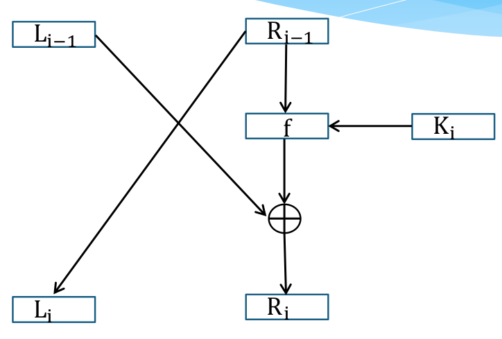

# Simple DES

Simple DES version with 12 bits blocks and 8 bits long key.

## Implementation
This little is an implementation of a simple DES. This cryptographic algorithm is depicted on the image below. The second image is the F-function used in this algorithm.




## Usage

To use this programm use the following command:

```
python3 simpleDES.py
```

then, the program will ask you for a text to encrpyt a key and number of rounds you want to use to encrypt your input.
